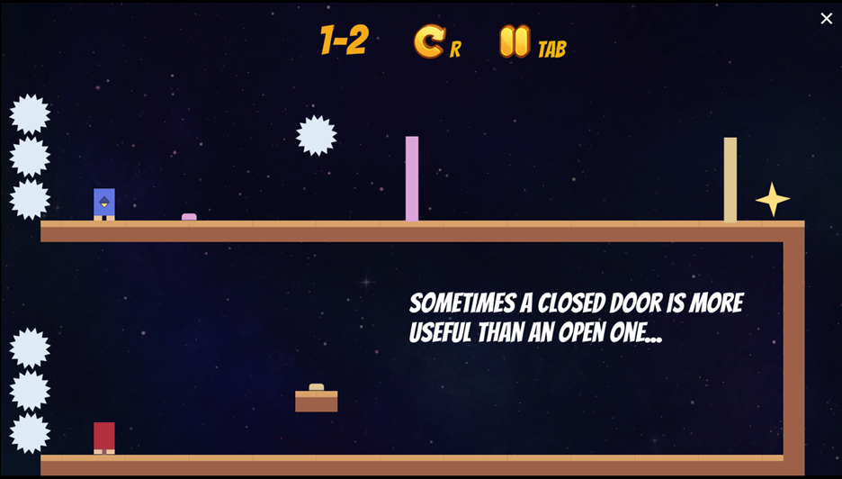
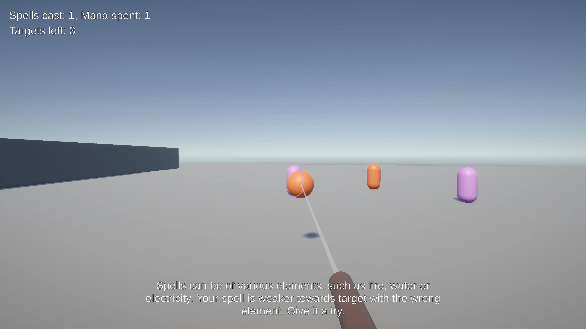

# Alter Ego

*A 2-D platformer where you manage a player and its clones to solve puzzles*

  

Developed for a course project over a span of 3 months with a team of 8! I was the team lead and made the following technical contributions:
 - Core loop design & GDD organization
 - Replay-value via secret locations/ability
 - Tilemap programming (fragile floor, rule-based auto-tiling)
 - Character run animation
 - Level design for following mechanics: Fragile floor, Reverse powerup, Stacking
 - [Analyze play-testing data](https://drive.google.com/file/d/1GJ2TCMG1Imdom3gJtshcjVMjB6-QXmWZ/view?usp=sharing) and improve scaffolding

Team management:
 - Version control setup & issue tracking
 - Task planning & meeting cadence
 - Code review and best practices



# Spell Crafter

*Developed in 72 hours for [Global Game Jam 2023](https://globalgamejam.org/2023/games/spell-crafter-0)*

  

Partake in a training program to craft various spells and practice them on targets in a challenging training arena. This game is about using your wits to maximize spell efficiency.

Contributions:
 - [GDD authoring](https://docs.google.com/document/d/1bpgvqLUAh2KFm38x1B09lKZv8ziRAPY3x0u9LvHuLNY/edit?usp=sharing)
 - Level design & scaffolding
 - Tornado spell programming (physics & particle system)


