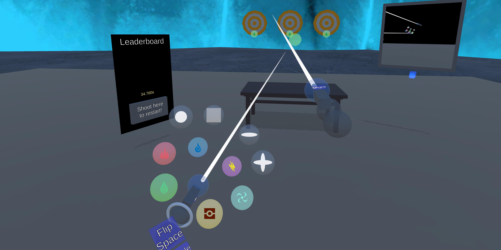

# Game Engine Development
*Implementing new features on reference engine (ongoing coursework)*
  
  

Features worked on:
 - **View frustum culling** based on OBB tests with FOV planes
 - Basic physics thread with **collision detection** for sphere and box colliders

# VR Research Volunteer

*Exploring new user interactions beyond 2D menus*

  

Working part-time under a PhD student as an engineer to help improve interactions in XR.
 - Port input controller from device-based to <a target="_blank" href="https://github.com/powenyao/XR-Interaction-Toolkit-Examples/wiki/Design:-Locomotion-System">action-based system</a>
 - Implemented <a target="_blank" href="https://github.com/powenyao/XR-Interaction-Toolkit-Examples/wiki/Design:-Controller-Manager">state machine and input manager</a> for customizable locomotion
 - Helped develop a demo for submission to <a target="_blank" href="https://s2023.siggraph.org/program/immersive-pavilion/">SIGGRAPH 2023</a>
